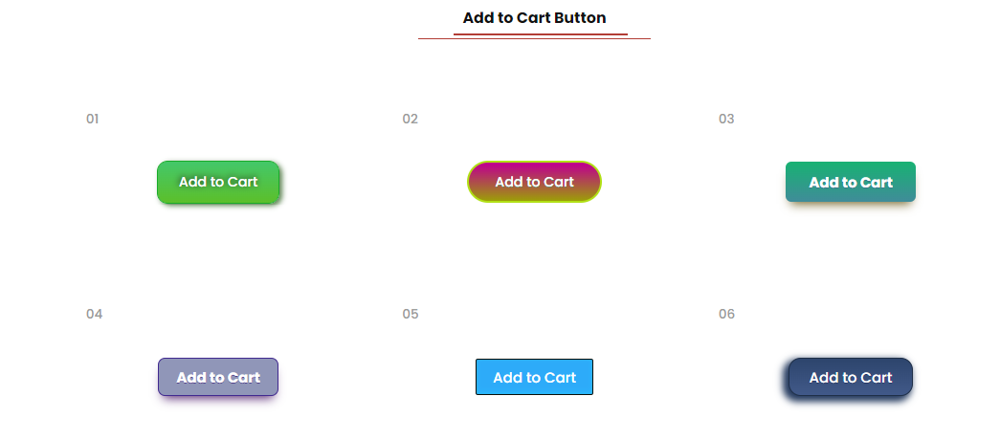

<!DOCTYPE html>
<html lang="en">
<head>
    <meta charset="UTF-8">
    <meta name="viewport" content="width=device-width, initial-scale=1.0">
    <link href="https://fonts.googleapis.com/css2?family=Roboto:wght@300;400&display=swap" rel="stylesheet">
    <title>Project Descriotion</title>

    
</head>
<body>

    <h2>Multiple CSS Button Styles and Hover Effects</h2>
     
    
A beautiful collection of simple and pretty CSS and hover animations for fully responsive buttons.

    

        

            Mahmudtpi97 manufactures different styles of buttons according to different needs of customers. 
            Here you will find different styles of buttons that you use every day. It's design is based on HTML5 and CSS3 – no JavaScript involved. So, you can easily implement the design by copying and pasting.
        

        <h3>Here we have:</h3>
        <ul>
            <li>1.eCommerce "Add to Cart" button.</li>
            <li>2. Register button</li>
            <li>3. Login button</li>
            <li>4. Submit button</li>
            <li> 5.Message button etc</li>
        </ul>

        <h3>Our Services:</h3>
         <ul>
             <li> 1. 1 year free supported.</li>
             <li>2. Solve any design related problems.</li>
             <li>3. Update/modify any code structure etc.</li>
         </ul>
        
        
 <strong>Technical details:</strong> These buttons use pure CSS3 code to render their appearance. Due to their reliance on CSS3, they will only work in modern browsers that fully support CSS3.

    
    

    

        
        
        
        
    

    

        <h3>HOW TO USE</h3>
        
Using button set on your website is fairly easy. To integrate it into your website, all you need to do is take the idea from the below structure .

       

            
<strong>HTML Code Use</strong>

            <code>
            <pre>
                 <!----  .... ---->
                &lt;div class="btn_item"&gt;
                    &lt;button class="button button-22">Send Message &lt;/button&gt;
                &lt;div &gt;
                <!----  .... ---->
            </pre>
            </code>

            
<strong>CSS Code Use</strong>

            <code>
            <pre>
                <!----  .... ---->
                &lt;style&gt;
                    .button-22-ts {
                        box-shadow: 4px 3px 7px 0px #5d8552;
                        background:transparent;
                        border-radius:15px;
                        border:2px solid #18ab29;
                        display:inline-block;
                        color:#000;
                        font-family:Poppins;
                        font-size:19px;
                        padding:14px 28px;
                        text-decoration:none;
                        text-shadow:-1px -1px 10px #1f211f;
                        transition: 1s;
                    }
                    .button-22-ts:hover {
                        background-color:#5cbf2a;
                        transition: 1s;
                    }
                &lt;/style&gt;  
                <!----  .... ---->
            </pre>
            </code>
       

    
        <h3>FILE CREATE</h3>
           
<strong>11/01/2023</strong>

        <h3>FILE UPDATE</h3>
        
<strong>No Update</strong>

    
    

 

</body>
</html>
